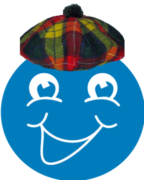

## Coordy Goes Golfing

This is a demo project to show off some cool features of [Turf JS](http://turfjs.org/).

## Instructions

1. Clone this repository
2. In the terminal, `cd` to the location where this is cloned
3. Run `npm install`
4. Create a file called `.env` at the root of the project
5. Add the following to the file: `REACT_APP_MAPBOX_ACCESS_TOKEN=<your_mapbox_token>`
6. Run `npm start`

## Meet Coordy The Coordinate

Your guide to understanding geospatial analysis.

